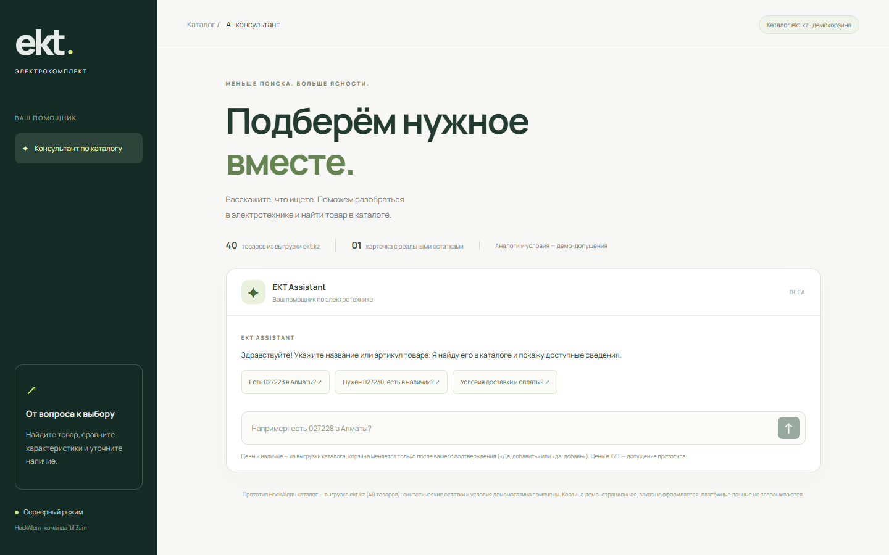
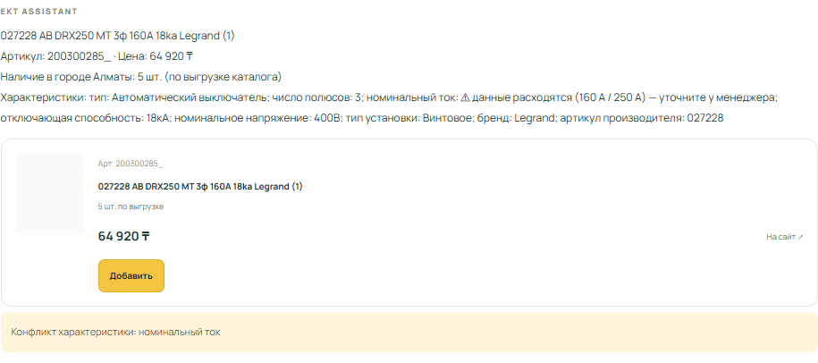
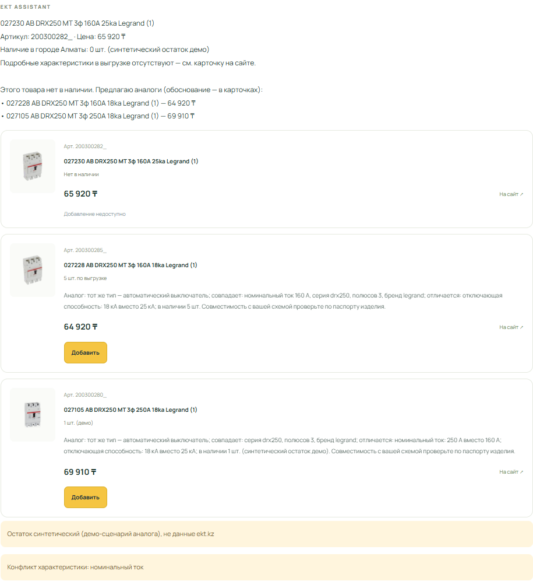
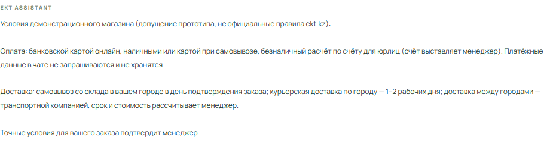
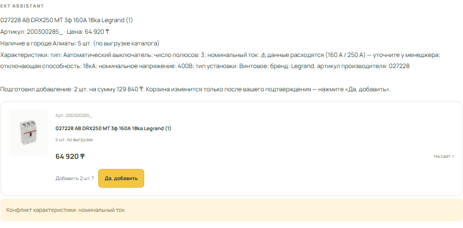
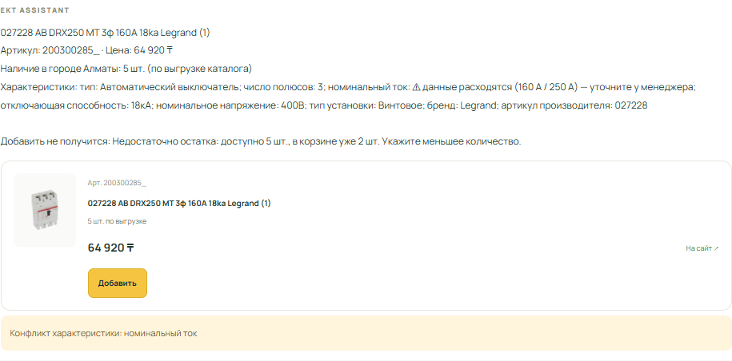
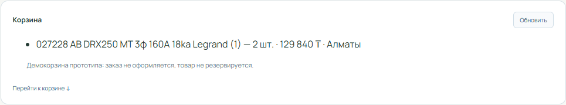
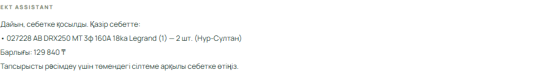
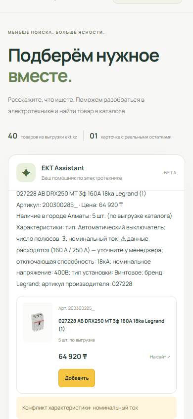
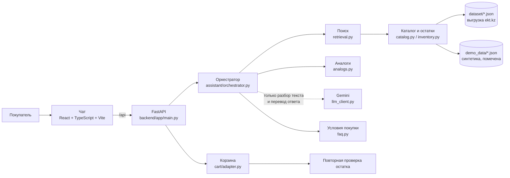

# EKT Assistant — ИИ-консультант для ekt.kz

**HackAlem AI · кейс ТОО «Электрокомплект» · команда ’til 3am**

Чат-ассистент для интернет-магазина электротехники. Покупатель пишет свободным текстом на русском или казахском и сразу получает:

- наличие по городу, цену и характеристики;
- честный ответ про сертификат;
- аналоги с объяснением, если товара нет;
- условия покупки;
- добавление в корзину, но **только после явного подтверждения** и не больше остатка.



---

## Содержание

1. [Быстрый запуск](#быстрый-запуск)
2. [Как проверить: 5 обязательных требований](#как-проверить-5-обязательных-требований)
3. [Казахский язык и мобильная версия](#казахский-язык-и-мобильная-версия)
4. [Архитектура](#архитектура)
5. [Безопасность и достоверность](#безопасность-и-достоверность)
6. [Данные](#данные)
7. [Тесты](#тесты)
8. [Ограничения](#ограничения)
9. [Структура репозитория](#структура-репозитория)

---

## Быстрый запуск

Нужны **Python 3.10+** и **Node.js 18+**. Запуск занимает около 3 минут. Команды даны для Windows PowerShell, для macOS и Linux они в комментариях.

### 1. Backend (терминал 1)

```powershell
git clone https://github.com/BAITC-Hacks/hack-682bab9a-til-3am.git
cd hack-682bab9a-til-3am

python -m venv .venv
.venv\Scripts\activate                      # macOS/Linux: source .venv/bin/activate
python -m pip install -r backend/requirements.txt

python -m uvicorn app.main:app --app-dir backend --host 127.0.0.1 --port 8000
```

Проверка: откройте http://127.0.0.1:8000/api/v1/health. Должно быть `{"status":"ok","products_loaded":40}`.

### 2. Frontend (терминал 2)

```powershell
cd frontend
npm install
Copy-Item .env.example .env.local      # macOS/Linux: cp .env.example .env.local
npm run dev
```

Откройте **http://127.0.0.1:5173**. Vite сам перенаправляет запросы `/api` на backend.

### 3. LLM (необязательно, нужен для казахского)

Без ключа ассистент полностью работает на русском в детерминированном режиме. Чтобы включить понимание казахского и живой речи:

1. Получите бесплатный ключ Google Gemini: https://aistudio.google.com/apikey
2. Создайте файл `backend/.env`:
   ```
   LLM_BASE_URL=https://generativelanguage.googleapis.com/v1beta/openai
   LLM_API_KEY=ваш_ключ
   LLM_TIMEOUT=12
   ```
3. Перезапустите backend.

Подходит любой OpenAI-совместимый провайдер (Groq, OpenRouter, NVIDIA), примеры в [backend/.env.example](backend/.env.example).

### Если что-то не работает

| Симптом | Решение |
|---|---|
| Чат отвечает про «DEMO-BREAKER», а не про реальные товары | Нет `frontend/.env.local`: выполните `Copy-Item .env.example .env.local` в папке `frontend` и перезапустите `npm run dev` |
| «Сервер недоступен (404/502)» | Backend не запущен на порту 8000 (шаг 1) |
| Порт 8000 занят | Закройте предыдущий запуск uvicorn или используйте другой порт и поменяйте его в `frontend/vite.config.ts` |
| Казахский ответ пришёл на русском | LLM не настроена или бесплатный тариф Gemini перегружен. Ответ всё равно верный: он из данных |

---

## Как проверить: 5 обязательных требований

Вводите запросы в чат по порядку, в одной вкладке. Чтобы начать заново с пустой корзиной, обновите страницу.

### 1. Наличие, характеристики, сертификат

**Ввести:** `Есть 027228 в Алматы?`

**Ожидается:** цена 64 920 ₸, **5 шт. в Алматы**, характеристики. В данных каталога номинальный ток указан по-разному: 160 А в названии и 250 А в свойствах. Ассистент **не скрывает противоречие**, а показывает предупреждение.



**Дальше:**
- `а в Нур-Султане?` → 8 шт. Ассистент помнит товар из контекста диалога.
- `покажи сертификат` → «файл сертификата в данных каталога не приложен» и ссылка на карточку. Ассистент **ничего не выдумывает**.

### 2. Аналоги, если товара нет

**Ввести:** `Нужен 027230`

**Ожидается:** «нет в наличии» и 2 аналога. На каждой карточке обоснование: что совпадает (тип, ток, серия, полюса), что отличается (отключающая способность), сколько в наличии и напоминание проверить совместимость.



### 3. Условия покупки

**Ввести:** `Условия доставки и оплаты?` или `минимальная партия?`

**Ожидается:** оплата, доставка и минимальная партия. В выгрузке ekt.kz этих условий нет, поэтому это **условия демомагазина**, и ответ помечает это явно.



### 4. Корзина только после явного подтверждения и в пределах остатка

**Ввести:** `Есть 027228 в Алматы?`, затем `добавь 2 штуки`

**Ожидается:** предложение на 2 шт. и 129 840 ₸ с кнопкой **«Да, добавить»**. **Корзина пока не изменилась.**



**Подтвердить:** нажать «Да, добавить» или написать `да, добавь`. Только теперь товар попадает в корзину.

**Проверка остатка:** `добавь 4 штуки` → отказ: «доступно 5 шт., в корзине уже 2 шт.»



**Попробуйте обойти:**
- `да` без предложения → «нечего подтверждать»;
- повторное «да» → количество не удваивается;
- два предложения подряд → подтверждается только последнее.

### 5. Ссылка на корзину

После подтверждения появляется панель корзины: позиции, сумма и ссылка «Перейти к корзине».



### Сводка

| # | Требование кейса | Запрос для проверки | Статус |
|---|---|---|---|
| 1 | Наличие, характеристики, сертификат | `Есть 027228 в Алматы?`, `покажи сертификат` | ✅ |
| 2 | Аналог с обоснованием при нулевом остатке | `Нужен 027230` | ✅ |
| 3 | Оплата, доставка, минимальная партия | `Условия доставки и оплаты?` | ✅ (демо-условия) |
| 4 | Корзина только после «да, добавь», не больше остатка | `добавь 2 штуки` → `да, добавь` → `добавь 4 штуки` | ✅ |
| 5 | Прямая ссылка на корзину | после подтверждения | ✅ (демокорзина) |

---

## Казахский язык и мобильная версия

### Казахский (опционально, требуется LLM)

**Ввести по очереди:**
1. `Сәлеметсіз бе! 027228 Астанада бар ма?`
2. `екеуін себетке қосыңызшы`
3. `иә, қосыңыз`

Ассистент понимает казахский (в том числе числа словами: «екеуін» = 2), отвечает по-казахски и добавляет товар после «иә». Цифры в ответе те же, что в каталоге.



### Мобильная версия

Вёрстка адаптивная. Автотест проверяет ширину 390 px (iPhone): горизонтальной прокрутки нет. Проверить вручную можно так: F12 → значок телефона.



---

## Архитектура



**Как обрабатывается сообщение:**

1. **Детерминированный разбор** (мгновенно): артикул, код производителя, слова из названия с синонимами («автомат» → «АВ»), количество (в том числе «две штуки», «екеуін»), город («в Астане» → склад «Нур-Султан»), намерение (добавить, аналог, сертификат, условия).
2. **LLM подключается только если нужна**: если детерминированный разбор ничего не нашёл, Gemini превращает живую фразу в поисковый запрос. Казахский ответ Gemini переписывает по-человечески.
3. **Ответ собирается только из данных**: цена, остаток, характеристики, аналоги.
4. **Корзина**: агент возвращает только намерение «добавить N шт.». Backend создаёт одноразовое предложение, ждёт подтверждения и повторно проверяет остаток.

Подробнее: [docs/ARCHITECTURE.md](docs/ARCHITECTURE.md).

### API

| Метод | Путь | Назначение |
|---|---|---|
| GET | `/api/v1/health` | Проверка сервера |
| POST | `/api/v1/sessions` | Новая анонимная сессия |
| POST | `/api/v1/sessions/{id}/messages` | Сообщение в чат → ответ, карточки товаров, предложение добавить; при текстовом «да» — обновлённая корзина |
| POST | `/api/v1/sessions/{id}/confirmations` | Создать предложение (кнопка «Добавить» на карточке) |
| POST | `/api/v1/sessions/{id}/confirmations/{cid}/confirm` | Подтвердить предложение (кнопка «Да, добавить») |
| GET | `/api/v1/sessions/{id}/cart` | Текущая корзина и ссылка на неё |

Интерактивная документация: http://127.0.0.1:8000/docs

---

## Безопасность и достоверность

| Требование кейса | Как обеспечено |
|---|---|
| Корзина не меняется без подтверждения | Агент не имеет доступа к корзине. Предложение одноразовое, живёт 5 минут и привязано к сессии, товару и количеству. Текстом подтверждается только последнее предложение |
| Защита от несанкционированного изменения | Чужая сессия не может подтвердить предложение (HTTP 409). Повторное подтверждение не удваивает количество |
| Не больше остатка | Остаток проверяется при создании предложения и **ещё раз** перед записью, с учётом того, что уже лежит в корзине |
| Недостоверные цены и наличие | Числа берутся только из каталога. **Все цифры в ответе LLM сверяются с данными: если модель изменила или добавила число, её ответ отбрасывается.** Неизвестный остаток показывается как «не уточнено», а не 0. Противоречия в данных (160/250 А) показываются |
| Объяснимость аналогов | В карточке перечислено, что совпадает, что отличается, сколько в наличии, и есть напоминание проверить совместимость |
| Платёжные данные | Не запрашиваются и не хранятся. Об этом написано в интерфейсе и в ответах об оплате |
| Приватность | Сессия анонимная, персональные данные не собираются. Ключ LLM хранится только на сервере в `backend/.env`, в git не попадает |
| Текст каталога и сообщения клиента как инструкции | Не выполняются: LLM получает их как данные, а цены и количество из сообщения клиента игнорируются |

---

## Данные

| Файл | Что внутри | Источник |
|---|---|---|
| `dataset/api_products.json`, `api_products_page2.json` | 40 товаров: название, артикул, цена, фото, ссылка | Выгрузка ekt.kz от партнёра |
| `dataset/api_products_detail.json` | Товар 515291 (027228): характеристики и остатки по 24 складам | Выгрузка ekt.kz от партнёра |
| `demo_data/stock_overrides.json` | Остатки для 4 товаров, чтобы показать сценарий «нет в наличии → аналог» | **Синтетика**, в интерфейсе помечена «демо» |
| `demo_data/faq.json` | Оплата, доставка, минимальная партия, возврат (с ключевыми словами на русском и казахском) | **Допущение демомагазина**, помечено в ответе |

Кейс разрешает синтетические данные с сохранением структуры полей. Реальные данные выгрузки не изменяются и не смешиваются с синтетикой.

---

## Тесты

```powershell
# Backend: 18 тестов по всем обязательным требованиям (без LLM, ключ не нужен)
python -m pip install -r backend/requirements-dev.txt
python -m pytest backend/tests -q

# Frontend e2e: 5 сценариев в браузере, включая мобильную вёрстку (нужен запущенный backend)
cd frontend
$env:E2E_LIVE="1"
$env:CHROME_PATH="C:\Program Files\Google\Chrome\Application\chrome.exe"   # или: npx playwright install
npx playwright test tests/live.spec.ts
```

Скриншоты для README пересоздаются командой `$env:SCREENSHOTS="1"; npx playwright test tests/readme-screenshots.spec.ts`.

---

## Ограничения

- **Данные.** Реальные остатки есть только у одного товара из 40, у остальных наличие «не уточнено». Сертификатов и условий покупки в выгрузке нет.
- **Корзина демонстрационная.** Она хранится в памяти сервера и сбрасывается при перезапуске. Настоящая корзина ekt.kz подключается реализацией `CartAdapter` ([cart/adapter.py](backend/app/cart/adapter.py)) без изменения логики подтверждения.
- **Вложения** (фото, Excel, Word, PDF) не реализованы.
- **Сопутствующие товары** не показываются: в поле `RECOMMEND` указаны товары, которых нет в выгрузке, а выдумывать их карточки мы не стали.
- **История для авторизованных пользователей** не реализована: в прототипе нет авторизации.
- **Эскалация на менеджера** частичная: при неизвестных данных ассистент советует обратиться к менеджеру, но диалог менеджеру не передаётся.
- **LLM на бесплатном тарифе** иногда отвечает медленно. В этом случае приходит ответ из данных на русском, функциональность не ломается.

---

## Структура репозитория

```
backend/
  app/
    main.py                  HTTP API, сессии, подтверждение корзины
    catalog.py               загрузка каталога, поиск, синонимы
    inventory.py             остатки по складам и городам
    faq.py                   условия покупки
    cart/adapter.py          MockCartAdapter: предложение → подтверждение → проверка остатка
    assistant/
      orchestrator.py        логика ассистента: намерения, ответы, аналоги, корзина
      retrieval.py           поиск товаров по артикулу, коду и названию
      analogs.py             объяснимый подбор аналогов
      llm_client.py          OpenAI-совместимый клиент (Gemini) и проверка чисел
  tests/                     автотесты backend
  .env.example               пример настроек LLM
frontend/
  src/main.tsx               интерфейс чата, карточки, корзина
  src/api.ts                 работа с API
  tests/                     e2e-тесты Playwright
dataset/                     выгрузка ekt.kz (40 товаров + 1 подробная карточка)
demo_data/                   синтетические остатки и условия демомагазина
docs/
  ARCHITECTURE.md            подробная архитектура и контракты
  screenshots/               скриншоты из README
```
