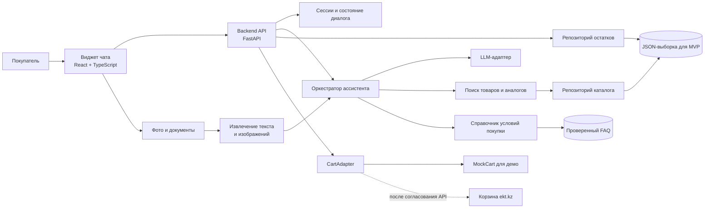
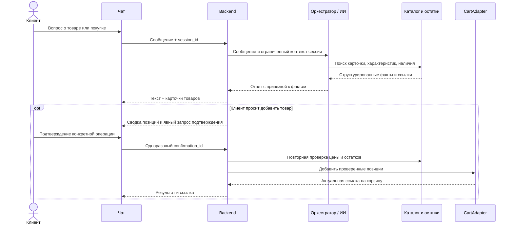

# Архитектура ИИ-ассистента ekt.kz

## Назначение и рамки MVP

Ассистент отвечает на вопросы о товарах по каталогу, показывает остатки и характеристики, подбирает объяснимые аналоги, отвечает на вопросы о покупке из проверенного справочника и предлагает добавить товар в корзину. Изменение корзины выполняется только после явного подтверждения пользователя и повторной проверки остатков.

В репозитории пока нет кода приложения или заданного стека. Для быстрого прототипа предлагается React + TypeScript для чата и FastAPI для API и логики ассистента. ИИ-логика остаётся отдельным модулем backend-приложения, а не самостоятельным сетевым сервисом: это упрощает локальный запуск и интеграцию втроём. Стек можно заменить, сохранив описанные контракты и границы ответственности.

## Компоненты



| Компонент | Ответственность |
| --- | --- |
| Виджет чата | Сообщения и история текущего диалога, карточки товаров, кнопки подтверждения, загрузка вложений, адаптивная мобильная вёрстка и ссылка на корзину. |
| Backend API | Сессии, валидация запросов, получение актуальных товаров и остатков, ограничения безопасности, маршрутизация действий в корзину. |
| Оркестратор ассистента | Определение намерения, выбор поиска или FAQ, вызов LLM для формулировки ответа, связывание ответа с данными-основаниями. |
| Репозитории данных | Нормализация каталога и складов; чтение из JSON в демо и замена источника на API партнёра без изменения логики диалога. |
| CartAdapter | Единый интерфейс для демо-корзины и будущей корзины ekt.kz. Только backend вызывает запись; модель не имеет прямого доступа к корзине. |
| Извлечение вложений | Извлечение текста из PDF, DOCX и XLSX, чтение изображения или OCR для JPEG. Извлечённый контент считается пользовательским вводом, а не доверенной инструкцией. |

## Поток диалога и подтверждение корзины



Правила подтверждения:

1. Ассистент сначала показывает товар, количество и склад/город (если выбор склада влияет на доступность), затем просит подтвердить добавление.
2. Подтверждение привязано к конкретным `product_id`, количеству и одноразовому `confirmation_id` с коротким сроком действия. Новое изменение состава или количества создаёт новое подтверждение.
3. При обработке подтверждения backend заново получает актуальные цену и доступный остаток. Если количества уже не хватает или цена изменилась, корзина не меняется; ассистент сообщает об изменении и запрашивает новое подтверждение.
4. В двусмысленных случаях, без незакрытого предложения или при истёкшем токене корзина не меняется. Для свободного текста «да» backend принимает подтверждение только как ответ на ожидающую подтверждения конкретную операцию.
5. LLM не формирует адреса корзины, цены и остатки самостоятельно. Backend выдаёт ссылку, которую вернул CartAdapter.

## Границы доверия и достоверность

- Поиск по точному артикулу/ID и структурированным характеристикам выполняется кодом. LLM помогает понять свободную формулировку и объяснить найденные данные; он не является источником фактов.
- Для каждого фактического ответа используются результаты каталога или проверенный FAQ. При отсутствии данных ответ сообщает, что информация не найдена, и предлагает связаться с менеджером. Нельзя додумывать наличие, сертификаты, доставку, оплату и минимальную партию.
- Вложения и текст пользователя не могут вызывать произвольные инструменты. Разрешённые операции фиксированы: найти товар, прочитать детали, проверить наличие, найти аналоги, прочитать FAQ. Добавление в корзину проходит через отдельную серверную проверку подтверждения.
- Не принимать цены, ID товаров, остатки и ссылку корзины от браузера как достоверные: backend самостоятельно разрешает их по каталогу/CartAdapter.
- Использовать анонимный идентификатор сессии или штатную сессию сайта. Не запрашивать платёжные реквизиты. Хранить историю только в объёме текущей сессии для прототипа; не сохранять исходные вложения и удалять временные файлы после обработки. Логи не должны содержать содержимое файлов и лишние персональные данные.
- Таймаут LLM или сбой поиска не должны блокировать безопасные действия: показать понятную ошибку/повтор, не изменяя корзину.

## Данные и модель каталога

### Что есть в репозитории

| Файл | Содержимое | Использование |
| --- | --- | --- |
| `dataset/api_products.json` | 20 кратких карточек первой страницы: ID, название, артикул, цена, изображение, URL и URL деталей. | Поиск и карточка результата. |
| `dataset/api_products_page2.json` | Ещё 20 кратких карточек; ID между двумя страницами не повторяются. | Дополнительная выборка для поиска и подбора аналогов. |
| `dataset/api_products_detail.json` | Одна расширенная карточка товара `515291`: описание, характеристики, общее количество и остатки по 24 складам. | Подробный ответ и демонстрация проверки наличия по складам. |

`count: 20` в обоих файлах совпадает с `per_page: 20`; по fixtures нельзя заключить, что это общий размер каталога. До уточнения контракта API не использовать `count` как общий размер каталога.

Каноническая модель, к которой адаптируются и JSON-файлы, и будущий API:

```text
Product
  id: string
  article: string | null
  name: string
  price: number | null
  currency: string | null
  description: string | null
  attributes: map<string, string | string[]>
  image_url: string | null
  product_url: string | null
  available_quantity: number | null
  stock_by_location: [{ location_id, location_name, quantity }]
  certificates: [{ title, url }] | []
  source_updated_at: datetime | null
```

Неизвестные значения оставлять `null`/пустыми, а не выводить из названия или URL. Валюта в выборке отдельным полем не задана. Политика доступных для продажи складов должна быть согласована с ekt.kz: складские названия включают специальные локации вроде брака и перемещения, поэтому нельзя без фильтра считать сумму всех складов доступным для заказа остатком.

### Ограничения выборки и проверка качества

- В кратких карточках нет остатков, подробных характеристик, категории и сертификатов; детальная запись есть только для одного ID. Карточки `offers` во всех 40 записях пусты.
- В детальной записи название и описание указывают на номинальный ток 160 А, а поле `properties.NOMINALNYY_TOK` содержит 250 А. Пока источник не подтвердит правильное значение, ассистент должен считать эту характеристику конфликтующей и не выдавать её как установленный факт.
- Категорию и атрибуты для качественного подбора аналогов нельзя считать полными. Для демо подбирать только среди доступной выборки, объяснять совпадающие характеристики и показывать, что это предварительное предложение. Не называть аналог эквивалентным без подтверждённых критериев.
- В предоставленных файлах нет сертификатов и утверждённых условий оплаты, доставки и минимальной партии. Для ответов на эти темы нужен отдельно утверждённый FAQ и база документов/ссылок.

### Загрузка и поиск

На старте backend загружает списки `items` из двух страниц, объединяет по `id`, а расширенные данные соединяет по тому же `id`. Парсер валидирует типы и логирует ошибки загрузки без публикации некорректных фактов. Источник данных подключается через интерфейсы `CatalogRepository` и `InventoryRepository`, чтобы заменить fixtures на партнёрский API.

MVP поиска не требует векторной базы: сначала нормализовать артикул и ID, искать точное совпадение, затем делать текстовый поиск по названию и атрибутам. Аналоги ранжировать только после фильтрации по совместимым категории и критичным параметрам, наличию для выбранной локации и другим ограничениям. LLM объясняет видимые совпадения; правила ранжирования возвращают основание каждого предложения. Векторный поиск можно добавить при наличии полного каталога и качественных характеристик.

## API-контракт для фронтенда

Все эндпоинты версионировать под `/api/v1`. Тела запросов и ответов описать в OpenAPI, типы фронтенда генерировать из схемы либо поддерживать совместно.

| Метод и путь | Назначение |
| --- | --- |
| `POST /api/v1/sessions` | Создать анонимную сессию диалога и вернуть её ID/защищённую cookie. |
| `POST /api/v1/sessions/{session_id}/messages` | Отправить текст, необязательные вложения и получить ответ, карточки товаров и необязательное ожидающее подтверждение. |
| `POST /api/v1/sessions/{session_id}/confirmations/{confirmation_id}` | Подтвердить конкретную операцию добавления в корзину. Токен одноразовый. |
| `GET /api/v1/sessions/{session_id}/cart` | Вернуть статус демо-корзины и актуальную ссылку, если CartAdapter может её предоставить. |

Пример ответа на сообщение:

```json
{
  "answer": "Нашёл товар по артикулу ...",
  "products": [
    {
      "id": "515291",
      "name": "...",
      "article": "200300285_",
      "price": 64920,
      "available_quantity": null,
      "product_url": "https://ekt.kz/...",
      "evidence": ["catalog.name", "inventory.location"]
    }
  ],
  "pending_confirmation": null
}
```

Поля в примере иллюстративны: `available_quantity` можно показывать только после согласования складской политики и актуальности данных. Клиентская часть отображает полученные сведения, но не пересчитывает цену/остаток и не вызывает методы корзины напрямую.

## Ответственность команды из трёх человек

| Роль | Зона владения | Совместная точка интеграции |
| --- | --- | --- |
| Бэкенд | FastAPI, схемы и OpenAPI, адаптер данных, сессии, валидация файлов, проверка остатков, CartAdapter, защита подтверждения. | Зафиксировать API-контракт и каноническую схему `Product`; предоставить MockCart и тестовый сценарий интеграции фронту и ИИ. |
| Фронтенд | Виджет React/TypeScript, поток чата, карточки, UX подтверждения, ошибки и загрузка вложений, мобильная адаптация. | Использовать только OpenAPI-контракт; отдельно отобразить состояния «ищу», «нужны уточнения», «ожидается подтверждение», «добавлено». |
| ИИ-агент | Классификация намерений, поиск/ранжирование и объяснение аналогов, промпт и LLM-адаптер, привязка ответов к фактам, извлечение содержимого вложений и fallback. | Вызывать только типизированные read-инструменты backend; возвращать структурированный ответ и предложение действия, но не исполнять изменение корзины. |

## Предлагаемая структура приложения

```text
backend/
  app/
    api/                 # HTTP и OpenAPI-схемы
    catalog/             # нормализация и CatalogRepository
    inventory/           # правила складов и InventoryRepository
    assistant/           # оркестратор, LLM adapter, retrieval, grounding
    attachments/         # обработчики PDF/DOCX/XLSX/JPEG
    cart/                # интерфейс CartAdapter и реализации mock/ekt
    faq/                 # утверждённые ответы об условиях покупки
  data/                  # локальные FAQ fixtures, без секретов
frontend/
  src/chat/              # виджет и состояния диалога
  src/api/               # типизированный клиент backend
dataset/                # предоставленные fixtures каталога
```

Это целевая раскладка для начала разработки; файлы приложения ещё не созданы.

## Этапы прототипа

1. Зафиксировать OpenAPI-контракт, модель `Product`, складскую политику и способ запуска mock-корзины.
2. Подключить JSON-адаптер, exact/fuzzy-поиск и проверяемые ответы по карточкам и наличию; неизвестные факты явно помечать как отсутствующие.
3. Добавить поиск аналогов с основаниями, утверждённый FAQ, LLM-адаптер с таймаутом и источниками фактов.
4. Реализовать виджет с карточками и безопасным явным подтверждением, затем MockCart с актуальной ссылкой для демонстрации.
5. Подключить обработчики требуемых форматов вложений, если остаётся время на качественную проверку; MVP должен корректно сообщать о неподдержанном или нечитаемом файле.

## Что требуется для production-интеграции

- Официальный способ чтения полного каталога и остатков, лимиты API, частота обновления и формат ошибок.
- Правило доступного остатка: какие склады учитывать, как выбирать город/самовывоз/доставку, резервировать ли товар.
- Подтверждённые значения характеристик для спорных записей; ссылки/файлы сертификатов; официальные условия оплаты, доставки и минимальной партии.
- API корзины ekt.kz: аутентификация, способ привязки к пользовательской сессии, изменение корзины, реакция на изменение цены/остатков и формат актуальной ссылки.
- Требования платформы сайта для встраивания чата, домены/CORS, CSP и политика хранения сессии.
- Выбранный LLM-провайдер, ключ в переменной окружения и допустимая политика передачи клиентских текстов/вложений провайдеру.

До появления этих сведений интеграции заменяются mock-адаптерами; демо не должно представляться как изменение настоящей корзины ekt.kz.
